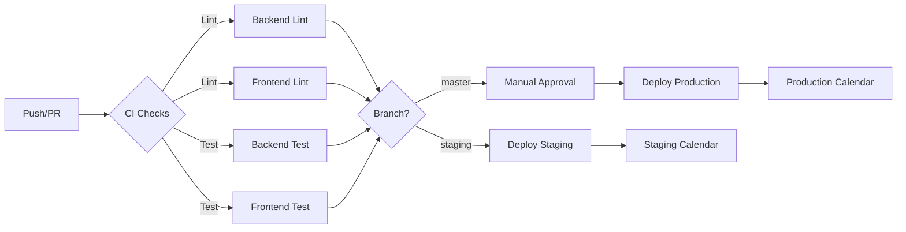

# Plano de Desenvolvimento - Próximas Features do Agendador

## Contexto

O projeto Agendador está com a **Fase 1 (Cadastros)** concluída, incluindo:
- ✅ Modelos de dados para `Profissional`, `Local`, `Sala`, `CapacidadeSala` e `PremissasGlobais`
- ✅ API REST completa com serializers e viewsets
- ✅ Sistema de autenticação funcional (login, logout, reset de senha, mudança de email)
- ✅ Frontend React/TypeScript com páginas CRUD para Profissionais, Locais e Premissas
- ✅ Infraestrutura com Docker Compose (backend, frontend, PostgreSQL, Redis)
- ✅ Makefile com comandos para desenvolvimento local e via containers
- ✅ Documentação completa em `docs/` e especificações em `spec/`

A **Fase 2 (Features Principais)** deve implementar:
1. Sistema de alocação e geração de escalas
2. Integração com Google Calendar
3. Jobs automáticos (geração semanal, confirmação diária, sync)
4. Motor de heurística para geração de escalas
5. Sistema de prompts para replanejamento
6. Dashboard com visualização e edição manual (drag-and-drop)

## Preparações Necessárias

### 1. Dependências Backend

> [!IMPORTANT]
> Adicionar as seguintes dependências ao `backend/requirements.txt`:

```
celery==5.3.4
redis==5.0.1
google-auth==2.25.2
google-auth-oauthlib==1.2.0
google-auth-httplib2==0.2.0
google-api-python-client==2.110.0
django-cors-headers==4.3.1
```

### 2. Dependências Frontend

> [!IMPORTANT]
> Adicionar bibliotecas para visualização e interação:

```bash
cd frontend
npm install @dnd-kit/core @dnd-kit/sortable @dnd-kit/utilities
npm install date-fns react-calendar
npm install recharts  # para gráficos no dashboard
```

### 3. Variáveis de Ambiente e Estratégia de Ambientes

> [!IMPORTANT]
> O projeto terá **3 ambientes separados**, cada um com seu próprio calendário Google:
> - **Desenvolvimento local** (`.env` local)
> - **Staging** (variáveis via GitHub Actions secrets)
> - **Produção** (variáveis via GitHub Actions secrets)

#### 3.1 Desenvolvimento Local

Atualizar `.env.example` (modelo para `.env` local):

```bash
# Ambiente
ENVIRONMENT=development

# Google Calendar API - Desenvolvimento
GOOGLE_CALENDAR_CREDENTIALS_FILE=/path/to/credentials-dev.json
GOOGLE_CALENDAR_TOKEN_FILE=/path/to/token-dev.json
GOOGLE_CALENDAR_SCOPES=https://www.googleapis.com/auth/calendar
# IDs dos calendários de desenvolvimento
GOOGLE_CALENDAR_GENERAL_ID=calendario-geral-dev@group.calendar.google.com

# Redis/Celery
REDIS_URL=redis://redis:6379/0
CELERY_BROKER_URL=redis://redis:6379/0
CELERY_RESULT_BACKEND=redis://redis:6379/0

# Jobs
GERACAO_SEMANAL_CRON=0 0 * * 6  # Sábado meia-noite
CONFIRMACAO_DIARIA_CRON=0 8 * * *  # Diariamente 8h
```

#### 3.2 Staging e Produção (GitHub Actions Secrets)

> [!IMPORTANT]
> Para os ambientes de **staging** e **produção**, todas as variáveis sensíveis serão configuradas como **GitHub Actions secrets**.

**Secrets necessários no GitHub:**

```yaml
# Staging
STAGING_SECRET_KEY
STAGING_POSTGRES_PASSWORD
STAGING_GOOGLE_CALENDAR_CREDENTIALS  # JSON base64
STAGING_GOOGLE_CALENDAR_TOKEN  # JSON base64
STAGING_GOOGLE_CALENDAR_GENERAL_ID
STAGING_EMAIL_HOST_PASSWORD

# Produção
PROD_SECRET_KEY
PROD_POSTGRES_PASSWORD
PROD_GOOGLE_CALENDAR_CREDENTIALS  # JSON base64
PROD_GOOGLE_CALENDAR_TOKEN  # JSON base64
PROD_GOOGLE_CALENDAR_GENERAL_ID
PROD_EMAIL_HOST_PASSWORD
```

**Calendários Google separados:**
- **Dev**: `agendador-dev-geral@group.calendar.google.com` + calendários individuais `-dev`
- **Staging**: `agendador-staging-geral@group.calendar.google.com` + calendários individuais `-staging`
- **Produção**: `agendador-prod-geral@group.calendar.google.com` + calendários individuais `-prod`

Isso permite testar todas as funcionalidades com recursos em nuvem sem interferir nos dados reais.

### 4. Celery Worker

Adicionar serviço ao `docker-compose.yml`:

```yaml
celery-worker:
  build: ./backend
  command: celery -A backend worker -l info
  volumes:
    - ./backend:/app
  environment:
    # mesmas variáveis do backend
  depends_on:
    - db
    - redis

celery-beat:
  build: ./backend
  command: celery -A backend beat -l info
  volumes:
    - ./backend:/app
  environment:
    # mesmas variáveis do backend
  depends_on:
    - db
    - redis
```

---

## Mudanças Propostas

### Backend Django

#### [NEW] [models.py](file:///home/rfcordeiro/agendador/backend/src/escala/models.py)

Nova app `escala` com modelos:

- **`Alocacao`**: profissional, local, sala, data, turno, origem (sistema/manual/google), status (gerado/revisado/confirmado/ajustado), inseguranca, metadata (JSON com pesos da heurística)
- **`ExecucaoJob`**: tipo, status, iniciou_em, terminou_em, diff_resumo, log_json, autor
- **`PromptHistory`**: prompt_texto, resposta, data, autor, acao, diff_resumo, publicada
- **`Troca`**: data, turno, local, profissional_origem, profissional_destino, motivo, origem, status
- **`AgendaGoogle`**: profissional, calendar_id, nome, ultima_sync, source_tag, pode_publicar
- **`EventoCalendar`**: agenda, alocacao (FK opcional), google_event_id, status, origem, data_sync

#### [NEW] [serializers.py](file:///home/rfcordeiro/agendador/backend/src/escala/serializers.py)

Serializers para todas as entidades acima com validações e severidades:
- **ERRO (bloqueia salvamento)**: Sobreposição de profissional/turno no mesmo horário
- **ERRO (severidade máxima)**: Conflitos com eventos existentes no Google Calendar
- **WARNING**: Limites de horas semanais excedidos (permite salvar, mas alerta)
- **WARNING**: Limites de dobras excedidos (permite salvar, mas alerta)
- **WARNING**: Bloqueios ou preferências não respeitados para manter premissas mais fortes

#### [NEW] [views.py](file:///home/rfcordeiro/agendador/backend/src/escala/views.py)

ViewSets REST para:
- Alocações (CRUD + filtros por profissional, local, data, status)
- Execuções de jobs (lista, detalhes)
- Prompts (criar, histórico)
- Trocas (registrar, aplicar, histórico)

Endpoints especiais:
- `POST /api/escala/gerar/` - Disparar geração de escala
- `POST /api/escala/publicar/` - Publicar no Google Calendar
- `POST /api/escala/sync/` - Sincronizar com Google (todas as agendas)
- `POST /api/escala/sync/{profissional_id}/` - Sincronizar apenas agenda de um profissional específico
- `GET /api/escala/inconsistencias/` - Listar inconsistências com severidades (ERROR, WARNING)
- `GET /api/escala/dashboard/` - Métricas agregadas
- `GET /api/escala/estatisticas/` - Estatísticas das últimas semanas (1, 2, 3, 4 semanas)

---

#### [NEW] [google_calendar.py](file:///home/rfcordeiro/agendador/backend/src/escala/google_calendar.py)

Serviço dedicado para Google Calendar:
- Autenticação OAuth2
- Leitura batch de eventos
- Escrita/atualização/deleção de eventos
- Detecção de conflitos
- Rate limiting e retry

---

#### [NEW] [heuristica.py](file:///home/rfcordeiro/agendador/backend/src/escala/heuristica.py)

Motor de geração de escalas:
- Round-robin ponderado
- Cálculo de pesos (preferências, repetições, carga atual)
- Detecção de inconsistências
- Geração de diff contra agenda atual
- Suporte a restrições hard e soft

Algoritmo conforme especificado em `spec/algoritmo.md`:
- **Escala homogênea para MEI e estagiárias**: Análise estatística das últimas 4 semanas para distribuir locais de forma equilibrada (não apenas evitar repetir na semana anterior)
- Balancear horas entre profissionais
- **Bloqueios e preferências**: Respeitar como premissas fortes; se não for possível, emitir aviso explicando qual premissa mais forte está sendo mantida
- Permitir dobras apenas quando necessário
- Marcar incerteza para semanas 3-4

---

#### [NEW] [tasks.py](file:///home/rfcordeiro/agendador/backend/src/escala/tasks.py)

Tasks do Celery:
- `geracao_semanal_task()` - Roda todo sábado
- `confirmacao_diaria_task()` - Roda diariamente
- `sync_google_task()` - Sincronização sob demanda
- `publicar_google_task(alocacoes_ids)` - Publicação manual

---

#### [MODIFY] [settings.py](file:///home/rfcordeiro/agendador/backend/src/backend/settings.py)

Adicionar:
```python
INSTALLED_APPS += ['escala', 'corsheaders', 'django_celery_beat']

CELERY_BROKER_URL = os.getenv('CELERY_BROKER_URL')
CELERY_RESULT_BACKEND = os.getenv('CELERY_RESULT_BACKEND')
CELERY_BEAT_SCHEDULE = {
    'geracao-semanal': {
        'task': 'escala.tasks.geracao_semanal_task',
        'schedule': crontab(hour=0, minute=0, day_of_week=6),
    },
    'confirmacao-diaria': {
        'task': 'escala.tasks.confirmacao_diaria_task',
        'schedule': crontab(hour=8, minute=0),
    },
}
```

---

#### [NEW] [urls.py](file:///home/rfcordeiro/agendador/backend/src/escala/urls.py)

Rotas REST para a app `escala`.

---

#### [MODIFY] [urls.py](file:///home/rfcordeiro/agendador/backend/src/backend/urls.py)

Incluir:
```python
path('api/escala/', include('escala.urls')),
```

---

### Frontend React/TypeScript

#### [NEW] [types/escala.ts](file:///home/rfcordeiro/agendador/frontend/src/types/escala.ts)

Tipos TypeScript para:
- `Alocacao`
- `ExecucaoJob`
- `PromptHistory`
- `Troca`
- `Inconsistencia`
- `DashboardMetrics`

---

#### [NEW] [lib/api-escala.ts](file:///home/rfcordeiro/agendador/frontend/src/lib/api-escala.ts)

Funções para comunicação com API:
- `fetchAlocacoes(filters)`
- `gerarEscala(params)`
- `publicarEscala(ids)`
- `syncGoogle()`
- `fetchInconsistencias()`
- `fetchDashboard()`
- `submitPrompt(texto)`

---

#### [NEW] [pages/DashboardPage.tsx](file:///home/rfcordeiro/agendador/frontend/src/pages/DashboardPage.tsx)

Dashboard principal com:
- Cards de métricas (gaps, conflitos, inconsistências, dobras)
- Calendário geral com código de cores por status e horizonte
- **Filtros avançados**: por profissional, local, turno, status
- **Estatísticas comparativas**: últimas 1, 2, 3 e 4 semanas (horas por profissional, distribuição de locais, dobras)
- **Botões de ação**:
  - Gerar escala
  - Sincronizar todas as agendas Google
  - Sincronizar agenda individual (seletor de profissional)
  - Publicar no Google Calendar

---

#### [NEW] [pages/EscalaPage.tsx](file:///home/rfcordeiro/agendador/frontend/src/pages/EscalaPage.tsx)

Visualização e edição de escalas:
- Tabela ou quadro Kanban com alocações
- Drag-and-drop para mover profissionais entre salas/turnos
- **Destaque de inconsistências por severidade**:
  - 🔴 ERRO: Conflitos com Google Calendar, sobreposições
  - ⚠️ WARNING: Limites de horas/dobras, bloqueios não respeitados
- Diff viewer antes de publicar
- **Formulário de prompt para replanejamento**: Interface para executar comandos via plataforma agêntica (Codex, Claude Code, OpenCode) via SSH

---

#### [NEW] [pages/HistoricoPage.tsx](file:///home/rfcordeiro/agendador/frontend/src/pages/HistoricoPage.tsx)

Histórico de:
- Execuções de jobs
- Prompts executados
- Trocas registradas

---

#### [NEW] [components/escala/CalendarioGeral.tsx](file:///home/rfcordeiro/agendador/frontend/src/components/escala/CalendarioGeral.tsx)

Componente de calendário com:
- Legenda por status (gerado, confirmado, ajustado, manual)
- Cores por horizonte (semana atual, próximas 2 semanas, semanas 3-4)
- Tooltips com detalhes de alocação
- Clique para editar

---

#### [NEW] [components/escala/DragDropBoard.tsx](file:///home/rfcordeiro/agendador/frontend/src/components/escala/DragDropBoard.tsx)

Quadro drag-and-drop:
- Colunas por local/sala ou turno
- Cards de profissionais arrastáveis
- Validação em tempo real de conflitos
- Uso de `@dnd-kit`

---

#### [NEW] [components/escala/InconsistenciasPanel.tsx](file:///home/rfcordeiro/agendador/frontend/src/components/escala/InconsistenciasPanel.tsx)

Painel de inconsistências com severidades:
- **Lista de conflitos com badges de severidade**:
  - 🔴 **ERROR** (severidade máxima): Conflitos Google Calendar, sobreposições
  - ⚠️ **WARNING**: Limites de horas, dobras, bloqueios não respeitados
- Ações sugeridas para cada inconsistência
- **Filtros**: por tipo (sobreposição, estouro, bloqueio violado) e severidade (ERROR, WARNING)
- Explicação de qual premissa mais forte está sendo mantida quando bloqueios não são respeitados

---

#### [NEW] [components/escala/PromptBox.tsx](file:///home/rfcordeiro/agendador/frontend/src/components/escala/PromptBox.tsx)

**Caixa para prompts agênticos**:
- Input de texto com sugestões pré-prontas
- **Integração com plataforma agêntica via SSH**:
  - Codex (GitHub Copilot Workspace)
  - Claude Code (Anthropic)
  - OpenCode (alternativas open-source)
- Execução remota de comandos via SSH
- Histórico de prompts executados
- Diff viewer antes de aplicar mudanças
- Aprovação/rejeição das alterações propostas
- Log de execução em tempo real

---

#### [NEW] [components/escala/DiffViewer.tsx](file:///home/rfcordeiro/agendador/frontend/src/components/escala/DiffViewer.tsx)

Visualizador de diferenças:
- Comparação lado a lado (antes/depois)
- Destaque de mudanças (adicionadas, removidas, modificadas)

---

#### [MODIFY] [App.tsx](file:///home/rfcordeiro/agendador/frontend/src/App.tsx)

Adicionar rotas:
- `/dashboard` - DashboardPage
- `/escala` - EscalaPage
- `/historico` - HistoricoPage

---

#### [MODIFY] [components/layout/Dashboard.tsx](file:///home/rfcordeiro/agendador/frontend/src/components/layout/Dashboard.tsx)

Adicionar links no menu de navegação para as novas páginas.

---

### Testes

#### [NEW] [tests/escala/test_models.py](file:///home/rfcordeiro/agendador/backend/tests/escala/test_models.py)

Testes unitários para:
- Criação de alocações
- Validações de sobreposição
- Cálculo de horas semanais
- Detecção de dobras

#### [NEW] [tests/escala/test_heuristica.py](file:///home/rfcordeiro/agendador/backend/tests/escala/test_heuristica.py)

Testes para:
- Geração de escala com diferentes cenários
- Respeito a restrições
- Balanceamento de carga
- Evitar repetições de local

#### [NEW] [tests/escala/test_google_calendar.py](file:///home/rfcordeiro/agendador/backend/tests/escala/test_google_calendar.py)

Testes com mock da API do Google:
- Leitura de eventos
- Escrita de eventos
- Detecção de conflitos
- Rate limiting

---

## Verificação

### Testes Automatizados Backend

```bash
# Rodar todos os testes
make backend-test

# Ou via Docker
make compose-backend-test
```

Os testes devem cobrir:
- ✅ Modelos de dados e validações
- ✅ Serializers
- ✅ Heurística de geração
- ✅ Integração Google Calendar (mockada)
- ✅ Tasks do Celery

### Testes Frontend

```bash
# Rodar testes do frontend
make frontend-test

# Ou via Docker
docker compose run --rm frontend npm test
```

### Testes Manuais

> [!IMPORTANT]
> Os seguintes testes manuais serão necessários após a implementação:

1. **Cadastro completo de dados**:
   - Criar ao menos 5 profissionais com preferências e restrições diferentes
   - Criar 3 locais com múltiplas salas
   - Configurar capacidades para diferentes dias/turnos
   - Configurar premissas globais

2. **Geração de escala**:
   - Acessar página de escala
   - Clicar em "Gerar Escala"
   - Verificar que alocações são criadas respeitando restrições
   - Verificar que inconsistências são listadas se houver

3. **Edição manual**:
   - Usar drag-and-drop para mover profissional de sala/turno
   - Verificar validação em tempo real
   - Salvar mudanças

4. **Sistema de prompts**:
   - Inserir prompt "Balancear horas desta semana"
   - Verificar diff gerado
   - Aprovar ou rejeitar mudanças

5. **Dashboard e métricas**:
   - Verificar cards de métricas (gaps, conflitos, dobras)
   - Usar filtros por profissional/local
   - Verificar calendário geral com código de cores

6. **Integração Google Calendar** (requer configuração OAuth):
   - Configurar credenciais do Google Calendar
   - Sincronizar eventos
   - Verificar detecção de conflitos
   - Publicar alocações no Google
   - Verificar eventos criados no Google Calendar

### Lint e Formatação

```bash
# Backend
make backend-lint
make backend-format
make backend-typecheck

# Frontend
make frontend-lint
make frontend-format
make frontend-typecheck
```

---

## Ordem de Implementação Sugerida

### Sprint 1: Fundação da Escala (1-2 semanas)
1. Criar app `escala` com modelos de dados
2. Criar migrations
3. Criar serializers e viewsets básicos
4. Criar tipos TypeScript no frontend
5. Criar funções de API no frontend

**Comandos de qualidade (executar via Docker Compose):**
```bash
# Backend
make compose-backend-lint
make compose-backend-format
make compose-backend-typecheck

# Frontend
make compose-frontend-lint
make compose-frontend-format
make compose-frontend-typecheck
```

### Sprint 2: Motor de Geração (1-2 semanas)
1. Implementar heurística de geração em `heuristica.py`
2. Criar endpoint de geração
3. Adicionar detecção de inconsistências
4. Testes unitários da heurística
5. UI básica para disparar geração

**Comandos de qualidade (executar via Docker Compose):**
```bash
# Backend
make compose-backend-lint
make compose-backend-format
make compose-backend-typecheck
make backend-test  # ou compose-backend-test quando disponível

# Frontend
make compose-frontend-lint
make compose-frontend-format
make compose-frontend-typecheck
```

### Sprint 3: Visualização e Edição (1-2 semanas)
1. Componente CalendarioGeral
2. Componente DragDropBoard
3. Página EscalaPage
4. Componente InconsistenciasPanel
5. Componente DiffViewer

**Comandos de qualidade (executar via Docker Compose):**
```bash
# Backend
make compose-backend-lint
make compose-backend-format
make compose-backend-typecheck

# Frontend
make compose-frontend-lint
make compose-frontend-format
make compose-frontend-typecheck
```

### Sprint 4: Dashboard e Métricas (1 semana)
1. Endpoint de métricas agregadas
2. Página DashboardPage
3. Cards de métricas
4. Gráficos com recharts

**Comandos de qualidade (executar via Docker Compose):**
```bash
# Backend
make compose-backend-lint
make compose-backend-format
make compose-backend-typecheck

# Frontend
make compose-frontend-lint
make compose-frontend-format
make compose-frontend-typecheck
```

### Sprint 5: Google Calendar (1-2 semanas)
1. Configurar OAuth2
2. Serviço google_calendar.py
3. Endpoints de sync e publicação
4. UI para sincronizar e publicar
5. Testes com mock

**Comandos de qualidade (executar via Docker Compose):**
```bash
# Backend
make compose-backend-lint
make compose-backend-format
make compose-backend-typecheck
make backend-test  # testar integrações mockadas

# Frontend
make compose-frontend-lint
make compose-frontend-format
make compose-frontend-typecheck
```

### Sprint 6: Sistema de Prompts (1 semana)
1. Modelos PromptHistory
2. Componente PromptBox
3. Integração com motor de geração
4. Histórico de prompts

**Comandos de qualidade (executar via Docker Compose):**
```bash
# Backend
make compose-backend-lint
make compose-backend-format
make compose-backend-typecheck

# Frontend
make compose-frontend-lint
make compose-frontend-format
make compose-frontend-typecheck
```

### Sprint 7: Jobs Automáticos (1 semana)
1. Configurar Celery
2. Tasks de geração semanal e confirmação diária
3. Atualizar docker-compose.yml
4. Testes de tasks

**Comandos de qualidade (executar via Docker Compose):**
```bash
# Backend
make compose-backend-lint
make compose-backend-format
make compose-backend-typecheck
make backend-test  # testar tasks do Celery

# Frontend (se houver mudanças)
make compose-frontend-lint
make compose-frontend-format
make compose-frontend-typecheck
```

### Sprint 8: Polimento e Testes (1 semana)
1. Testes end-to-end
2. Correção de bugs
3. Documentação de uso
4. Guia de deploy

**Comandos de qualidade final (executar via Docker Compose):**
```bash
# Backend - Validação completa
make compose-backend-lint
make compose-backend-format
make compose-backend-typecheck
make backend-test

# Frontend - Validação completa
make compose-frontend-lint
make compose-frontend-format
make compose-frontend-typecheck
make frontend-test
```

---

## Riscos e Considerações

> [!WARNING]
> **Integração Google Calendar**: Requer configuração cuidadosa de OAuth2 e rate limiting. Sugestão: começar com sandbox/calendários de teste.

> [!WARNING]
> **Complexidade da Heurística**: O algoritmo de geração pode precisar de ajustes finos. Recomenda-se iteração com usuários reais.

> [!CAUTION]
> **Publicação de Eventos**: Implementar dupla confirmação antes de sobrescrever/deletar eventos do Google Calendar, especialmente eventos passados.

> [!TIP]
> **Sábados Especiais**: Lembrar que sábados Savassi/Lourdes têm processo manual. O sistema deve apenas registrar e validar, não reescrever.

---

## Documentação Adicional a Criar

- [ ] Guia de configuração do Google Calendar OAuth2 (para os 3 ambientes)
- [ ] Guia de uso do sistema de prompts
- [ ] Manual do usuário para edição de escalas
- [ ] Troubleshooting de jobs do Celery
- [ ] ADR para decisões de arquitetura (algoritmo, Google Calendar, Celery)
- [ ] **Configuração de GitHub Actions secrets** para staging e produção
- [ ] **Workflow de CI/CD** para deploy automatizado

---

## CI/CD e Estratégia de Deploy

### GitHub Actions Workflow

> [!IMPORTANT]
> Criar `.github/workflows/ci-cd.yml` para automatizar lint, testes e deploy.

**Workflow sugerido:**

```yaml
name: CI/CD

on:
  push:
    branches: [master, staging]
  pull_request:
    branches: [master]

jobs:
  lint-backend:
    runs-on: ubuntu-latest
    steps:
      - uses: actions/checkout@v3
      - name: Lint Backend
        run: make compose-backend-lint

  lint-frontend:
    runs-on: ubuntu-latest
    steps:
      - uses: actions/checkout@v3
      - name: Lint Frontend
        run: make compose-frontend-lint

  test-backend:
    runs-on: ubuntu-latest
    steps:
      - uses: actions/checkout@v3
      - name: Test Backend
        run: make backend-test

  test-frontend:
    runs-on: ubuntu-latest
    steps:
      - uses: actions/checkout@v3
      - name: Test Frontend
        run: make frontend-test

  deploy-staging:
    needs: [lint-backend, lint-frontend, test-backend, test-frontend]
    if: github.ref == 'refs/heads/staging'
    runs-on: ubuntu-latest
    environment: staging
    steps:
      - uses: actions/checkout@v3
      - name: Deploy to Staging
        env:
          STAGING_SECRET_KEY: ${{ secrets.STAGING_SECRET_KEY }}
          STAGING_POSTGRES_PASSWORD: ${{ secrets.STAGING_POSTGRES_PASSWORD }}
          STAGING_GOOGLE_CALENDAR_CREDENTIALS: ${{ secrets.STAGING_GOOGLE_CALENDAR_CREDENTIALS }}
          # ... outras variáveis
        run: |
          # Script de deploy para staging (Hetzner ou outro)
          echo "Deploy para staging"

  deploy-production:
    needs: [lint-backend, lint-frontend, test-backend, test-frontend]
    if: github.ref == 'refs/heads/master'
    runs-on: ubuntu-latest
    environment: production
    steps:
      - uses: actions/checkout@v3
      - name: Deploy to Production
        env:
          PROD_SECRET_KEY: ${{ secrets.PROD_SECRET_KEY }}
          PROD_POSTGRES_PASSWORD: ${{ secrets.PROD_POSTGRES_PASSWORD }}
          PROD_GOOGLE_CALENDAR_CREDENTIALS: ${{ secrets.PROD_GOOGLE_CALENDAR_CREDENTIALS }}
          # ... outras variáveis
        run: |
          # Script de deploy para produção (Hetzner ou outro)
          echo "Deploy para produção"
```

### Configuração dos Calendários Google

**Para cada ambiente, criar:**

1. **Desenvolvimento:**
   - Calendário geral: `agendador-dev-geral@group.calendar.google.com`
   - Calendários de profissionais: `[Tetê Araújo Dev] Nome Profissional`
   - Credenciais OAuth2 salvas em `backend/credentials-dev.json` (gitignored)

2. **Staging:**
   - Calendário geral: `agendador-staging-geral@group.calendar.google.com`
   - Calendários de profissionais: `[Tetê Araújo Staging] Nome Profissional`
   - Credenciais OAuth2 em GitHub Actions secrets (base64)

3. **Produção:**
   - Calendário geral: `agendador-prod-geral@group.calendar.google.com`
   - Calendários de profissionais: `[Tetê Araújo] Nome Profissional`
   - Credenciais OAuth2 em GitHub Actions secrets (base64)

### Fluxo de Deploy



### Testes em Cada Ambiente

> [!TIP]
> Com calendários separados por ambiente, é possível testar todas as funcionalidades de integração sem riscos.

**Checklist de testes por ambiente:**

- [ ] **Desenvolvimento:** Testar geração, edição manual, prompts, sync Google
- [ ] **Staging:** Validar jobs automáticos (Celery), publicação em calendário staging, testes end-to-end
- [ ] **Produção:** Monitorar jobs, validar sincronização, acompanhar métricas

